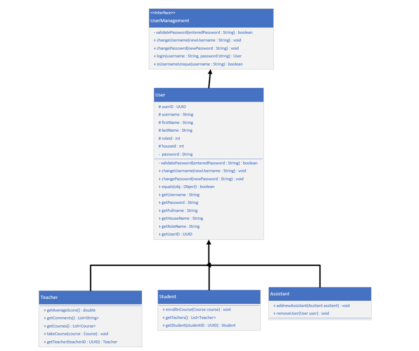

# Hogwarts School of Witchcraft and Wizardry

Welcome to hogwarts! (No Safety Insurance)

## Prerequisites ✅

Before diving into the enchanting world of Hogwarts:

- Java 21
- Git
- Gradle as a package manager

## Description
-  This is a school management program. There are three types of users: 
    1. Admin
   2. Teacher
   3. Student

- Students and Teachers need to sign up and wait for an admin to confirm their access
- Admins can create new courses, see existing ones, manage students and teachers and more
- Teachers can take up classes, score students, see their scores and the comments that students left behind for them
- Students can enroll in classes, see their grades, and score teachers and leave comments for them

## About this app
So, as said earlier, welcome to hogwarts. They don't really use our technology, but whatever.
This is program is an assignment of my Advanced Programming Course in University.

1. The first thing that I needed to do to complete the class definitions and to implement inheritance and polymorphism in here. I have used an __interface__, an abstract class implementing that interface, and thee classes extending that __abstract class__

    1. I Have Utilized Abstract Classes and Interfaces
    2. Drawn a Class Diagram for the mentioned interface and classes

    
   
    3. All passwords are stored hashed and encrypted, using SHA2556.
2. The next thing to do was to find a way to manage the user data. The data is stored in Hogwarts class as static lists. Hogwarts has multiple methods to manage adding/editing/viewing data
3. I initialized some data so the app could work. Use this login information to log in the app:
    
    * Admin (Albus Dumbledore)
      * Username: Wiz
      * Password: SherbetLemon
    * Teacher (Severus Snape)
      * Username: PotionsMaster
      * Password: AlwaysLily
    * Student (Harry Potter)
      * username: TheBoyWhoLived
      * password: ScarHead

    See all the initialized data in Hogwarts Static Constructor

4. The last and the easiest part was making the menu. The project is basically a loop that will contiue loading and askingthe user to either sign-up or login, or choose an item from the admin/teacher/student menu
   * All the things that were asked, is implemented. Examples:
     * Teachers and students can sign up, and then they should wait for an admin to confirm their request
     * An admin, once logged in, can:
       * confirm the mentioned sign-up requests
       * add new administrator accounts
       * view all the courses and the enrolled students in them
       * view all the students and teachers and view their profile
       * delete students or teachers
       * add new courses
       * logout
     * A teacher, once logged in, can:
       * View all the courses that have no teacher associated with them and take them as their own course
       * View all the current courses that they have and the students that have enrolled in them
       * Select the mentioned students and grade them
       * View their own average score (based on the scored that students have given them)
       * View all the comments that the students have left for them
       * logout
     * A student, once logged in, can:
       * View the courses they have not enrolled in, and enroll in them
       * View the courses that they currently have, and the score that the teachers have given them
       * Score the teachers they have classes with and leave them comments
       * View all the teachers they currently have class with
   * __The list of students is sorted based on their full name__

* Even with all the things this school manager app lac ks, it's still better than Golestan.

### Executing program

* Open the project in IntelliJ
* run Main

## Help

Read README if you needed more help.

You could contact the authors down below for more help.

## Authors

ex. Mehrdad Shirvani  
[Email Me](mailto:mehrdadsh0901@gmail.com)

This project is licensed under the [CC BY] License - see the LICENSE.md file for details
 API Using JAVA](https://medium.com/swlh/getting-json-data-from-a-restful-api-using-java-b327aafb3751)